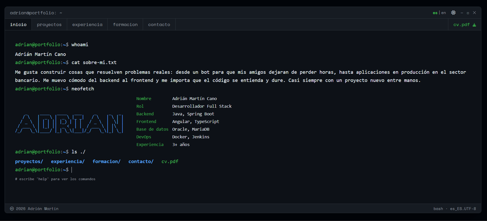

<p align="right"><b>🇪🇸 Español</b> · <a href="README.en.md">🇬🇧 English</a></p>

```
adrian@portfolio:~$ neofetch

    _     ____   ____   ___     _     _   _     Name        Adrián Martín Cano
   / \   |  _ \ |  _ \ |_ _|   / \   | \ | |    Role        Full Stack Developer
  / _ \  | | | || |_) | | |   / _ \  |  \| |    Backend     Java · Spring Boot
 / ___ \ | |_| ||  _ <  | |  / ___ \ | |\  |    Frontend    Angular · TypeScript
/_/   \_\|____/ |_| \_\|___|/_/   \_\|_| \_|    Foco        Producción · banca + cliente real
```

**Full Stack Developer** — Java/Spring Boot + Angular. Construyo y mantengo aplicaciones **en producción** (sector bancario y cliente real), del backend al frontend. Me importa que el código se entienda y dure, y casi siempre tengo un proyecto nuevo entre manos.

<p>
  <a href="https://www.codeadrianmc.dev">
    
  </a>
  <a href="https://www.linkedin.com/in/adrianmartincano/">
    
  </a>
  <a href="mailto:hello@codeadrianmc.dev">
    
  </a>
  <a href="https://www.codeadrianmc.dev/AdrianMartinCano.pdf">
    
  </a>
</p>

```
adrian@portfolio:~$ cat now.txt

Ahora        Evolucionando mi ecosistema de librerías (Spring Boot + Angular)
Buscando     Que su uso sea aún más eficiente
A fondo      Angular · Spring Batch · DevOps (deploy, arquitectura)
Cacharreo    Homelab propio: Docker · Coolify · WireGuard · Cloudflare
Idiomas      Español (nativo) · Inglés
Estado       Abierto a nuevas oportunidades
Café/día     ∞
Música       a tope mientras programo
PD           Voy lleno de tatuajes — que no te pille de sorpresa 😉
```

---

## 📌 Proyectos destacados

**[WoW Auction Analyzer](https://subasta.codeadrianmc.dev)** — Plataforma full-stack que analiza la casa de subastas de World of Warcraft, detecta oportunidades de mercado y avisa por Discord en tiempo real.
`Java` · `Spring Boot` · `Spring Batch` · `Angular` · `Discord (JDA)` · `PostgreSQL`
🔗 [Demo en vivo](https://subasta.codeadrianmc.dev) · [Repo](https://github.com/AdrianMartinCano/wow-analizer)

**[Artesanos del Torno](https://artesanosdeltorno.es)** — Web oficial **en producción** de una asociación nacional de artesanos: panel de administración, e-commerce con Stripe y newsletter automática.
`Producción` · `Stripe` · `E-commerce`
🔗 [Web en vivo](https://artesanosdeltorno.es) · [Repo](https://github.com/AdrianMartinCano/artesanosdeltorno)

**Ecosistema de librerías compartidas** — Suite de librerías reutilizables (Spring Boot + Angular) publicadas para construir aplicaciones web profesionales en una fracción del tiempo.
`Spring Boot` · `Angular` · `GitHub Packages` · `Arquitectura`
🔗 [Backend](https://github.com/AdrianMartinCano/libreriasBackend) · [Frontend](https://github.com/AdrianMartinCano/librerias-frontend)

**[Portfolio (terminal)](https://www.codeadrianmc.dev)** — Esta web: frontend Angular con concepto de terminal Linux y API propia en Spring Boot. Multiidioma, prefetch, comandos interactivos.
`Angular` · `TypeScript` · `Tailwind` · `Spring Boot`
🔗 [Web en vivo](https://www.codeadrianmc.dev) · [Front](https://github.com/AdrianMartinCano/portfolio) · [Back](https://github.com/AdrianMartinCano/portfolio-back)

**KeyCloud** — Gestor de contraseñas seguro full-stack: cliente Angular y API en Spring Boot.
`Angular` · `Spring Boot` · `Seguridad`
🔗 [Frontend](https://github.com/AdrianMartinCano/keycloud-front) · [Backend](https://github.com/AdrianMartinCano/keycloud)

---

## 🖥️ El portfolio en acción

<p align="center">
  <a href="https://www.codeadrianmc.dev">
    
  </a>
</p>

---

## 🧰 Stack

```
adrian@portfolio:~$ cat stack.txt

Backend       Java · Spring Boot · Spring Batch · JPA / Hibernate
Frontend      Angular · TypeScript · RxJS · Tailwind CSS
Datos         PostgreSQL · MariaDB · Oracle
DevOps        Docker · Jenkins · Git · Coolify
APIs / otros  Discord (JDA) · Stripe · Resend · GitHub Packages
```

---

## 📈 GitHub

<p align="center">
  
  
</p>

<div align="center">
  
</div>

---

<p align="center">
  <code>adrian@portfolio:~$ open <a href="https://www.codeadrianmc.dev">www.codeadrianmc.dev</a>&nbsp;&nbsp;&nbsp;# ¿hablamos?</code>
</p>
